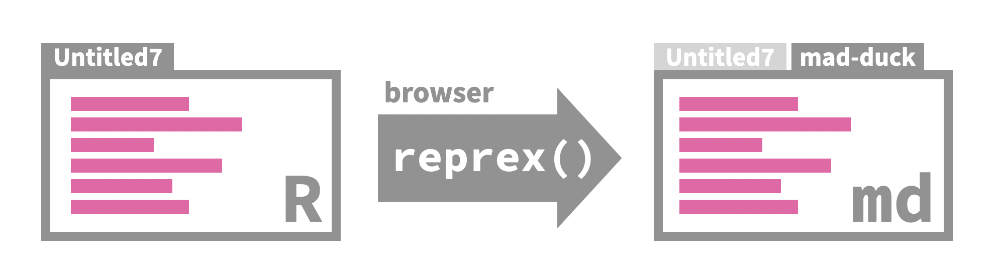

```{r setup, include = FALSE}
# R options
options(
  htmltools.dir.version = FALSE,
  dplyr.print_min = 6, 
  dplyr.print_max = 6,
  tibble.width = 65,
  width = 65
  )
# figure height, width, dpi
knitr::opts_chunk$set(echo = TRUE, 
                      fig.width = 8, 
                      fig.asp = 0.618,
                      out.width = "60%",
                      fig.align = "center",
                      dpi = 300,
                      message = FALSE)
# ggplot2
ggplot2::theme_set(ggplot2::theme_gray(base_size = 16))
# set seed
set.seed(1234)
# xaringanExtra
library(xaringanExtra)
xaringanExtra::use_panelset()
# output number of lines
hook_output <- knitr::knit_hooks$get("output")
knitr::knit_hooks$set(output = function(x, options) {
  lines <- options$output.lines
  if (is.null(lines)) {
    return(hook_output(x, options))  # pass to default hook
  }
  x <- unlist(strsplit(x, "\n"))
  more <- "..."
  if (length(lines)==1) {        # first n lines
    if (length(x) > lines) {
      # truncate the output, but add ....
      x <- c(head(x, lines), more)
    }
  } else {
    x <- c(more, x[lines], more)
  }
  # paste these lines together
  x <- paste(c(x, ""), collapse = "\n")
  hook_output(x, options)
})
```

class: middle

.huge[you...]

- use and teach tidyverse
- want to update your usage and teaching of tidyverse

```{r}
library(tidyverse)
```

---

class: middle

# lifecycle

---

## Lifecycle stages

```{r echo = FALSE, out.width = "80%"}
knitr::include_graphics("images/lifecycle.png")
```

.tip[
Be aware of the stages (and their associated badges) as you review/revise your teaching materials or as you consider incorporating new tooling into your teaching.
]

---

background-image: url("images/lifecycle-stable.svg")
background-position: 90% 5%
background-size: 20% 8%

## Stable

- Breaking changes avoided where possible, only made if long term benefit > short term pain of changing existing code

- If breaking change needed, it will occur gradually

- Badge generally not shown as it applies to huge majority of functions

.tip[
Teach away!
]

---

background-image: url("images/lifecycle-deprecated.svg")
background-position: 90% 5%
background-size: 20% 8%

## Deprecated

- Has a better alternative available and is scheduled for removal

- Process: Soft deprecated $\rightarrow$ deprecated $\rightarrow$ defunct

- Can apply to functions and arguments

--

- Examples:
  - `tibble()` not `data_frame()`
  - in `nest()`: `new_col` not `.key`

--

.tip[
Don't teach and correct usage suggesting the alternative.
]

---

background-image: url("images/lifecycle-superseded.svg")
background-position: 90% 5%
background-size: 20% 8%

## Superseded

- Has a known better alternative, but the function not going away

--

- Examples:
  - `tidyr::spread()` / `tidyr::gather()` vs. `tidyr::pivot_longer()` / `tidyr::pivot_wider()`
  - Scoped verbs (e.g., `dplyr::mutate_if()`, `dplyr::select_at()`, `dplyr::rename_all()`, etc.) vs. `dplyr::across()`
  - `dplyr::sample_n()` / `dplyr::sample_frac()` vs. `dplyr::slice_sample()` with `n` and `prop` arguments

--

.tip[
Don't teach and discourage use, suggesting the alternative.
]

---

background-image: url("images/lifecycle-experimental.svg")
background-position: 90% 5%
background-size: 20% 8%

## Experimental

- Made available so people can try them out and provide feedback, but come with no promises for long term stability

--

- Examples:
  - `dplyr::group_trim()` to unused levels of all factors that are used as grouping variables
  - in `dplyr::summarize()`: `.groups` argument to define the grouping structure of the result
  - in `dplyr::mutate()`: `.before` and `.after` arguments to control where new columns should appear

--

.tip[
Teach with caution, but don't discourage use.
]

---

## Learn more

- Talk: Maintaining the house the tidyverse built

.center[
<a href="https://www.rstudio.com/resources/rstudioglobal-2021/maintaining-the-house-the-tidyverse-built/?wvideo=f7ph68edqb"></a></p><p><a href="https://www.rstudio.com/resources/rstudioglobal-2021/maintaining-the-house-the-tidyverse-built/?wvideo=f7ph68edqb"></a>
]

- Blog post: https://www.tidyverse.org/blog/2021/02/lifecycle-1-0-0/

---

class: middle

# rvest

```{r}
library(rvest)
```

---

class: middle

.tip[
If you've been teaching web scraping with **rvest**, update your code before you teach next time!
]

---

## New function: `html_text2()`

Better handling of line breaks

```{r}
html <- minimal_html(
  "<p>  
    This is a paragraph.
    This another sentence.<br>This should start on a new line
  </p>"
)
```

```{r}
html %>% html_text() %>% writeLines()  # old
html %>% html_text2() %>% writeLines() # new
```

---

## Updated behaviour: `html_table()`

Better handling of column spans and returns a tibble

```{r}
html <- minimal_html("<table>
  <tr><th>A</th><th>B</th><th>C</th></tr>
  <tr><td colspan='2' rowspan='2'>1</td><td>2</td></tr>
  <tr><td rowspan='2'>3</td></tr>
  <tr><td>4</td></tr>
</table>")

html %>%
  html_element("table") %>%
  html_table()
```

---

## Superseded functions: `html_node()` and `html_nodes()`

- Recommended alternatives: `html_element()` and `html_elements()`

- Motivation: Vobulary alignment between HTML (the language) and what rvest calls "things"

---


## Learn more

- Blog post: https://www.tidyverse.org/blog/2021/03/rvest-1-0-0/

- Updated rvest vignette: https://rvest.tidyverse.org/articles/rvest.html

---

class: middle

# reprex

```{r}
library(reprex)
```

---

class: middle

.tip[
Use on RStudio Server and RStudio Cloud!
]

---

## reprex in the browser

Improved experience when using RStudio in the browser (e.g. RStudio Server or RStudio Cloud)

```{r fig.alt = "Default input/output is the current selection in RStudio Server and Cloud. Reproducible example is pasted into a new document with a randomly generated name: mad-duck.", echo = FALSE}

```

---

## Local files in reprex

Use new argument `wd` to set working directory of the reprex (instead of the less intuitive `reprex(outfile = NA)` to use current working directory)

```{r eval = FALSE}
reprex(wd = ".")
```

--

.tip[
Helpful for student questions using local data!
]

---

## Use project-level `.Rprofile`

Reprexing in the current working directory also means using the project-level `.Rprofile`, especially helpful with project uses [renv](https://rstudio.github.io/renv/articles/renv.html)

```{r eval = FALSE}
reprex(wd = ".")
```

--

.tip[
May be less relevant for new learners, but a useful tool if the suite you teach with is different than what you have locally installed (e.g. CRAN versions to teach, dev vesions to play!)
]

---


## Learn more

- Blog post: https://www.tidyverse.org/blog/2021/04/reprex-2-0-0/

---

class: middle

# dbplyr / dtplyr

```{r}
library(dtplyr)
library(dbplyr)
```

---

class: middle

.tip[
Maybe you use it to teach (or maybe not), but you can definitely use them to learn data.table and SQL!
]

---

## dtplyr

**dtplyr** translates dplyr pipelines into equivalent **data.table** code

```{r}
mtcars_dt <- lazy_dt(mtcars)

cyl_summary <- mtcars_dt %>% 
  group_by(cyl) %>% 
  summarise(across(disp:wt, mean))

# result
cyl_summary %>% as_tibble()
```

---

## Translation

```{r}
# query
cyl_summary %>% show_query()
```

---

## dtplyr for some tidyr functions!

```{r}
fish_encounters_dt <- lazy_dt(fish_encounters)

fish_encounters_wider <- fish_encounters_dt %>%
  pivot_wider(names_from = station, values_from = seen, values_fill = 0)

# result
fish_encounters_wider %>% as_tibble()
```

---

## Translation

```{r}
# query
fish_encounters_wider %>% show_query()
```

---

## dbplyr

**dbplyr** translates dplyr pipelines into equivalent **SQL** code

```{r}
fish_encounters_db <- memdb_frame(fish_encounters)

fish_encounters_wider <- fish_encounters_db %>%
  pivot_wider(names_from = station, values_from = seen, values_fill = 0)

# result
fish_encounters_wider %>% as_tibble()
```

---

## Translation

```{r}
# query
fish_encounters_wider %>% show_query()
```

---

## Learn more

- Blog post: https://www.tidyverse.org/blog/2021/02/dplyr-backends/
- dtplyr: https://dtplyr.tidyverse.org/articles/translation.html
- dbplyr: https://dbplyr.tidyverse.org/articles/dbplyr.html

---

class: middle

# tidymodels

---

## What is tidymodels?

The **tidymodels** framework is a collection of packages for modeling and machine learning using tidyverse principles.

```{r}
library(tidymodels)
```

---

```{r out.width="95%", echo=FALSE}
knitr::include_graphics("images/tidymodels.png")
```

---

## Motivation for tidymodels

- Provide similar interfaces to models
- Help users avoid pitfalls
- Pedagogical advantages

---

## Provide similar interfaces to models

- Q: How do you define the the number of trees when fitting a random forest model?

--
- A: Depends on the package: `randomForest::randomForest()` uses `ntree`, `ranger::ranger()` uses `num.trees`, Spark's `sparklyr::ml_random_forest()` uses `num_trees`.

--
- A, with tidymodels: 

```{r eval = FALSE}
rf_mod <- rand_forest(trees = 2000)
```

---

## Help users avoid pitfalls

<br>

> *"Many models, especially complex predictive or machine learning models, can work very well on the data at hand but may fail when exposed to new data. Often, this issue is due to poor choices made during the development and/or selection of the models. Whenever possible, [tidymodels] software, documentation, and other materials attempt to prevent these and other pitfalls."* [[Source](https://www.tmwr.org/index.html)]

<br>

--
- Tidymodels pipelines start with splitting data into training and testing sets, and facilitate keeping them separate
- Tidymodels is opioniated about which functions can be applied to testing data

---

## Pedagogical advantages

For simple `lm()`, might hard to see the advantage:

.small[
.pull-left[
```{r}
# base R
lm(hwy ~ cty, data = mpg) %>%
  summary()
```
]
.pull-right[
```{r}
# tidymodels
linear_reg() %>%
  set_engine("lm") %>%
  fit(hwy ~ cty, data = mpg) %>%
  tidy()
```
]
]

---

## Pedagogical advantages

Though easier to see the advantage in the summary step.

.small[
.pull-left[
```{r}
# base R
lm(hwy ~ cty, data = mpg) %>%
  tidy()
```
]
.pull-right[
```{r}
# tidymodels
linear_reg() %>%
  set_engine("lm") %>%
  fit(hwy ~ cty, data = mpg) %>%
  tidy()
```
]
]

---

## Pedagogical advantages

More clear as you move on to different models

.pull-left[
```{r eval = FALSE}
# different engines
linear_reg() %>%
  set_engine("lm") %>%
  set_mode("regression")

logistic_reg() %>% 
  set_engine("glm") %>%
  set_mode("classification")

rand_forest() %>% 
  set_engine("ranger") %>% 
  set_mode("regression")

decision_tree() %>% 
  set_engine("rpart") %>% 
  set_mode("regression")
```
]
.pull-right[
```{r}
# same engine, different modes
svm_linear() %>% 
  set_engine("LiblineaR") %>% 
  set_mode("regression")

svm_linear() %>% 
  set_engine("LiblineaR") %>% 
  set_mode("classification")
```
]

---

## Pedagogical advantages

Build on dplyr pipelines to build recipes

```{r echo = FALSE}
library(openintro)
```

.small[
.pull-left[
```{r eval = FALSE}
# dplyr for data wrangling


openintro::email %>%
  select(-from, -sent_email) %>%
  mutate(
    day_of_week = lubridate::wday(time),
    month = lubridate::month(time)
  ) %>%
  select(-time) %>%
  mutate(
    cc = cut(cc, breaks = c(0, 1)),
    attach = cut(attach, breaks = c(0, 1)),
    dollar = cut(dollar, breaks = c(0, 1))
  ) %>%
  mutate(
    inherit = cut(inherit, breaks = c(0, 1, 5, 10, 20)),
    password = cut(password, breaks = c(0, 1, 5, 10, 20))
  )
```
]
.pull-right[
```{r eval = FALSE}
# recipes for data preprocessing and feature engineering
# same steps, similar syntax, 
# less bookkeeping for the analyst in modeling setting
recipe(spam ~ ., data = openintro::email) %>%
  step_rm(from, sent_email) %>%
  step_date(
    time, 
    features = c("dow", "month")
    ) %>%
  step_rm(time) %>%
  step_cut(
    cc, 
    attach, 
    dollar, breaks = c(0, 1)
    ) %>%
  step_cut(
    inherit, 
    password, breaks = c(0, 1, 5, 10, 20)
    )
```
]
]

---

## Learning resources

.large[
`r emo::ji("chequered_flag")` **Get started** with tidymodels: [tidymodels.org/start](https://www.tidymodels.org/start/)

`r emo::ji("page_facing_up")` **Learn** more and go further: [tidymodels.org/learn](https://www.tidymodels.org/learn/)

`r emo::ji("blue_book")` **Tidy Modeling with R** by Max Kuhn & Julia Silge: [tmwr.org](https://www.tmwr.org/)
]

---

## Teaching resources

**Data Science in a Box** ([datasciencebox.org](https://datasciencebox.org/)) contains slides, application exercises, computing labs, and homework assignments on modelling and inference with tidymodels:

.midi[
- Slides and application exercises:
  - [Modelling data](https://datasciencebox.org/making-rigorous-conclusions.html#modelling-data)
  - [Classification and model building](https://datasciencebox.org/making-rigorous-conclusions.html#classification-and-model-building)
  - [Model validation](https://datasciencebox.org/making-rigorous-conclusions.html#model-validation)
  - [Uncertainty quantification](https://datasciencebox.org/making-rigorous-conclusions.html#uncertainty-quantification)
- [Labs](https://datasciencebox.org/making-rigorous-conclusions.html#labs-2)
  - Grading the professor: Fitting and interpreting simple linear regression models
  - Smoking while pregnant: Constructing confidence intervals, conducting hypothesis tests, and interpreting results in context of the data
- [Homework assignments](https://datasciencebox.org/making-rigorous-conclusions.html#homework-assignments-1):
  - Bike rentals in DC: Exploratory data analysis and fitting and interpreting models
  - Exploring the GSS: Fitting and interpreting models
  - Modelling the GSS: Model validation and inference
]

---

class: middle

# Upcoming

---

## Updates to watch out for

- **infer** for theoretical inference pipelines and bootstrapping for regression with multiple predictors
- **parsnip** for using the default engine without an additional step in the modeling pipeline
- **readr** for reading in many csv files at once (like with vroom)
- updated/new cheatsheets!
