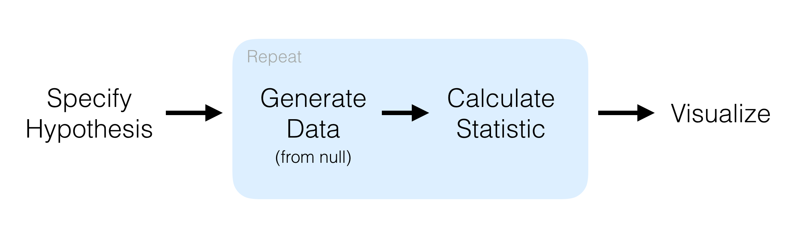

```{r setup, include=FALSE}
library(tidyverse)
library(tidymodels)
knitr::opts_chunk$set(error = TRUE)
```

# infer

The objective of this package is to perform statistical inference using an expressive statistical grammar that coheres with the `tidyverse` design framework.
The package is centered around expressive verbs, supplemented with many utilities to visualize and extract value from their outputs.



**Example:** Constructing a bootstrap interval.

```{r}
set.seed(1234)

# construct a bookstrap distribution
boot_dist <- gss %>%
  specify(response = hours) %>%
  generate(reps = 1000, type = "bootstrap") %>%
  calculate(stat = "mean")

# use infer helpers to visualize
boot_dist %>% 
  visualize()

# or use ggplot2 to visualize
boot_dist %>%
  ggplot(aes(x = stat)) +
  geom_histogram()


# use infer helpers to get confidence interval bounds
boot_dist %>%
  get_confidence_interval(level = 0.95)

# or use dplyr to get confidence interval bounds
boot_dist %>%
  summarise(
    lower = quantile(stat, 0.025),
    upper = quantile(stat, 0.975)
  )
```

**Motivation** for **infer** is primarily **pedagogical** to

-   Enable teaching introductory statistics (and data science) with the tidyverse
-   Use computing to express and demonstrate not-so-simple statistical ideas like resampling, bootstrapping, p-values, etc.

But, as of earlier this year:

1.  There were a couple important issues on the infer **vocabulary** that have been open for years where educators who are infer champions were awaiting resolution.
2.  infer didn't handle **theoretical inference** (as) well (as simulation-based inference): Very few courses teach only simulation-based inference, theoretical inference is generally taught alongside it, but infer didn't provide as expressive a grammar for theoretical inference, and inconsistencies between simulation-based and theoretical inference made it difficult to teach the parallels between these methods.
3.  infer didn't extend to **multiple regression** models: [Guidelines for Assessment and Instruction in Statistics Education (GAISE)](https://www.amstat.org/asa/files/pdfs/GAISE/GaiseCollege_Full.pdf) recommend teaching multivariable relationships early (and often). Many modern intro stat courses (those most likely to adopt the tidyverse) teach descriptive multiple regression and inference for multiple regression (e.g. bootstrapping and hypothesis testing for slopes in regression models with multiple predictors) but infer didn't provide an API for these, making it difficult for these courses to teach their full curriculum with tidyverse + infer.

All contributing to the following commonly expressed sentiment by statistics educators (simplified and paraphrased):

> "You can't teach intro statistics with the tidyverse because you can't do inference with the tidyverse."

-   Camp 1: Do everything with base R so `t.test(), prop.test()`, etc. syntax feels familiar.

-   Camp 2: Use formula syntax and the [**mosaic**](https://cran.r-project.org/web/packages/mosaic/index.html) package, which is designed specifically for teaching this material.

-   Camp 3: Teach data wrangling and visualization with tidyverse, inference with (mostly) base R.

-   Camp 4: Teach data wrangling and visualization with tidyverse, simulation-based inference with infer, theoretical inference also with infer *(but not without lots of struggles!)*

The following is a summary of recent updates to infer to address these issues.

-   NEWS: <https://github.com/tidymodels/infer/blob/master/NEWS.md>
-   All implementation by Simon Couch!
-   **Next milestone:** infer 1.0 release later this week + tidyverse blog post to follow.

```{r}
# install_github("tidymodels/infer@theoretical")
library(infer)
```

## 1. Naming things is hard

-   Original issue: <https://github.com/tidymodels/infer/issues/233> (great example for what could have been a tidyup, IMO!)

-   `generate()`: Generation creates a simulated distribution from `specify()`.
    In the context of confidence intervals, this is a bootstrap distribution based on the result of `specify()`.
    In the context of hypothesis testing, this is a null distribution based on the result of `specify()` and `hypothesize()`.

    -   Original options: `bootstrap`, `permute`, or `simulate`

    -   New options: `bootstrap`, `permute`, or `draw` (`simulate` is now superseded)

```{r}
gss %>%
  specify(response = college, success = "degree") %>%
  hypothesize(null = "point", p= 0.5) %>%
  generate(reps = 10, type = "simulate") # now generates a message
```

## 2. Framework for (expressive) theoretical inference

-   Previous state of affairs.

    -   Could do hypothesis testing using simulation-based methods and theoretical methods, but they looked very different.

        ```{r}
        # simulation based
        set.seed(1234)

        null_dist <- gss %>%
          specify(response = hours) %>%
          hypothesize(null = "point", mu = 40) %>%
          generate(reps = 1000, type = "bootstrap") %>%
          calculate(stat = "mean")

        x_bar <- gss %>%
          specify(response = hours) %>%
          calculate(stat = "mean")

        get_p_value(null_dist, x_bar, direction = "two-sided")

        # theoretical
        gss %>%
          t_test(response = hours, mu = 40, alternative = "two-sided")
        ```

    -   Could not do confidence intervals using theoretical methods.

-   Follow up to discussion on naming things at <https://github.com/tidymodels/infer/issues/399>, implemented in <https://github.com/tidymodels/infer/pull/400>.

    -   Conclusion: Instead of `generate()`, an `assume()` step for the distribution to be assumed for inference.

-   Hypothesis testing:

```{r}
obs_stat <- gss %>%
  specify(response = hours) %>%
  hypothesize(null = "point", mu = 40) %>%
  calculate(stat = "t")

obs_stat

null_dist <- gss %>%
  specify(response = hours) %>%
  hypothesize(null = "point", mu = 40) %>%
  assume(distribution = "t")
  #**does df need to be explicitly specified? could it be calculated under the hood?

null_dist

get_p_value(null_dist, obs_stat, direction = "both")

visualize(null_dist)

visualize(null_dist) + 
  shade_p_value(obs_stat, direction = "both")
```

-   Confidence intervals:

```{r}
obs_mean <- gss %>%
  specify(response = hours) %>%
  calculate(stat = "mean")

ci <- 
  get_confidence_interval(
    null_dist,
    level = .95,
    point_estimate = obs_mean
  )

ci

visualize(null_dist) + 
  shade_confidence_interval(ci) # Need better plot title!
```

## 3. Inference for multiple linear + logistic regression

-   Implemented in <https://github.com/tidymodels/infer/pull/387>
-   `fit.infer` method for `fit()` (with the goal bridging the gap between infer and rest of tidymodels / `parsnip::fit()`)
-   Type of regression determined by type of outcome variable or supplied with `family` argument in `fit()`

```{r}
# install_github("tidymodels/infer")
library(infer)
library(testthat)

# linear regression
expect_equal(
  gss %>%
    specify(hours ~ age + college) %>%
    fit(),
  gss %>%
    specify(hours ~ age + college) %>%
    fit(family = stats::gaussian)
)

# logistic regression
expect_equal(
  gss %>%
    specify(college ~ age + hours) %>%
    fit(),
  gss %>%
    specify(college ~ age + hours) %>%
    fit(family = stats::binomial)
)
```

-   Hypothesis testing for all slopes: a bit slow but...

```{r}
obs_fit <- gss %>%
  specify(hours ~ age + college) %>%
  fit()

null_distn <- gss %>%
  specify(hours ~ age + college) %>%
  hypothesize(null = "independence") %>%
  generate(reps = 100, type = "permute") %>%
  fit()

visualize(null_distn)
```

Generating a distribution of fits where each explanatory variable is permuted independently:

```{r}
null_distn2 <- gss %>%
  specify(hours ~ age + college) %>%
  hypothesize(null = "independence") %>%
  generate(reps = 1000, type = "permute", cols = c(age, college)) %>%
  fit()
```

------------------------------------------------------------------------

**QUESTION:** *Is `cols` a good argument name here? We were tying to stay consistent with argument names in tidyverse/tidymodels.*

> `cols`: If type = "permute", a set of unquoted column names in the data to permute (independently of each other).
> Defaults to only the response variable.
>
> `variables` as an alternative.\*

------------------------------------------------------------------------

-   NOTE: Finding some inconsistencies with confidence intervals, need to look into it next!

## Bonus: JOSS paper!

A short paper for JOSS on infer, led by Simon: <https://github.com/tidymodels/infer/pull/401>.
Good to go soon after CRAN submission.

# Teaching the tidyverse in 2021

Updates to highlight:

## tidymodels

Also make a pitch for tidymodels

### Why incorporate tidymodels?

-   Interested in incorporating tidymodels into your stats / data science curriculum?
    See [**bit.ly/tidymodels-uscots21**](https://bit.ly/tidymodels-uscots21/) for an introduction to the ecosystem as well as a discussion on the motivation behind tidymodels and pedagogical reasons to take on this challenge.
    Here is a short summary:

    -   For simple `lm`, might hard to see the advantage:

        ```{r}
        # base R
        lm(hwy ~ cty, data = mpg) %>%
          summary()

        # tidymodels
        linear_reg() %>%
          set_engine("lm") %>%
          fit(hwy ~ cty, data = mpg) %>%
          tidy()
        ```

    -   Though easier to see the advantage in the summary step:

        ```{r}
        # base R
        lm(hwy ~ cty, data = mpg) %>%
          tidy()

        # tidymodels
        linear_reg() %>%
          set_engine("lm") %>%
          fit(hwy ~ cty, data = mpg) %>%
          tidy()
        ```

    -   Pedagogical advantages more clear as you move on to different models:

        ```{r eval = FALSE}
        # different engines
        linear_reg() %>%
          set_engine("lm") %>%
          set_mode("regression")

        logistic_reg() %>% 
          set_engine("glm") %>%
          set_mode("classification")

        rand_forest() %>% 
          set_engine("ranger") %>% 
          set_mode("regression")

        decision_tree() %>% 
          set_engine("rpart") %>% 
          set_mode("regression")

        # same engine, different modes
        svm_linear() %>% 
          set_engine("LiblineaR") %>% 
          set_mode("regression")

        svm_linear() %>% 
          set_engine("LiblineaR") %>% 
          set_mode("classification")
        ```

    -   Build on dplyr pipelines to build recipes:

        ```{r}
        library(openintro)

        # dplyr for data wrangling
        email %>%
          select(-from, -sent_email) %>%
          mutate(
            day_of_week = lubridate::wday(time),
            month = lubridate::month(time)
          ) %>%
          select(-time) %>%
          mutate(
            cc = cut(cc, breaks = c(0, 1)),
            attach = cut(attach, breaks = c(0, 1)),
            dollar = cut(dollar, breaks = c(0, 1))
          ) %>%
          mutate(
            inherit = cut(inherit, breaks = c(0, 1, 5, 10, 20)),
            password = cut(password, breaks = c(0, 1, 5, 10, 20))
          )

        # recipes for data preprocessing and feature engineering
        # same steps as above, similar syntax, 
        # less bookkeeping for the analyst in modeling setting
        recipe(spam ~ ., data = email) %>%
          step_rm(from, sent_email) %>%
          step_date(
            time, 
            features = c("dow", "month")
            ) %>%
          step_rm(time) %>%
          step_cut(
            cc, 
            attach, 
            dollar, breaks = c(0, 1)
            ) %>%
          step_cut(
            inherit, 
            password, breaks = c(0, 1, 5, 10, 20)
            )
        ```

### How tidymodels?

------------------------------------------------------------------------

**QUESTION:** *I have an extended example ready to share that includes data splitting, recipe and workflow building, and model performance evaluation. Is this worth expanding in the blog post?*

-   *Pro: Main audience for the blog post is educators, so it's good to give them a brief but full story of a tidymodels pipeline*
-   *Con: It's not novel compared to what's already on tidymodels.org.*

------------------------------------------------------------------------

## Other packages

-   rvest: <https://www.tidyverse.org/blog/2021/03/rvest-1-0-0/>
-   reprex, highlight RStudio Server / Cloud: <https://www.tidyverse.org/blog/2021/04/reprex-2-0-0/>
-   lifecycle recommendations for instructors: <https://www.tidyverse.org/blog/2021/02/lifecycle-1-0-0/>
-   dbplyr / dtplyr, if you haven't taught SQL or data.table before: <https://www.tidyverse.org/blog/2021/02/dplyr-backends/>
-   parsnip (default engine)

------------------------------------------------------------------------

**QUESTION:** *What else should I highlight? When is new readr coming out?*

------------------------------------------------------------------------
